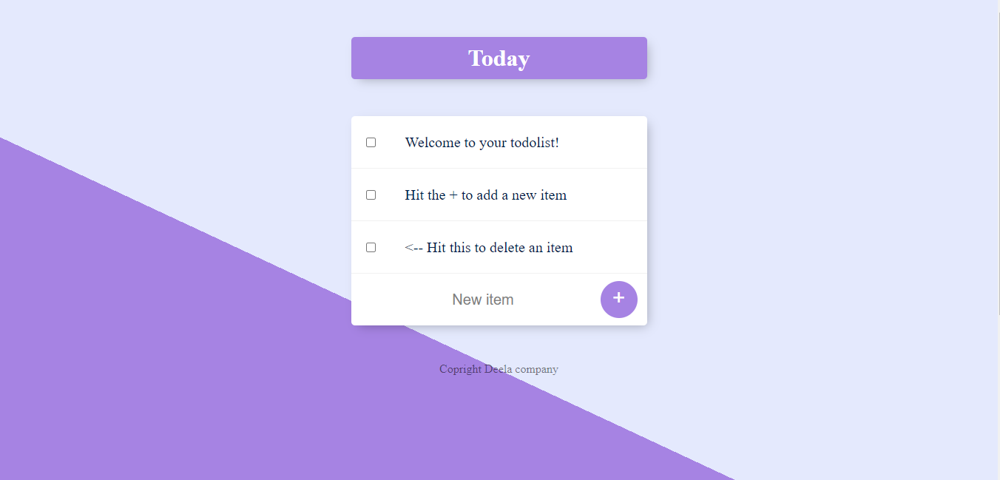
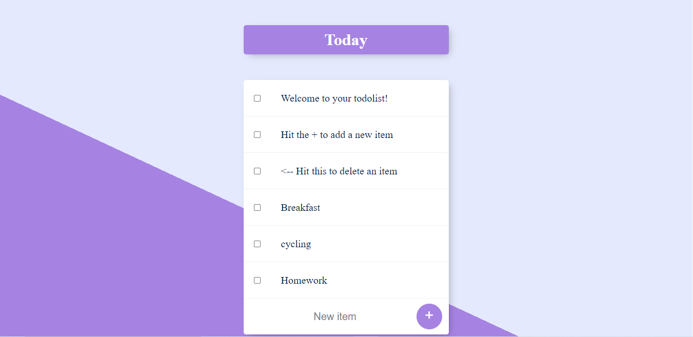
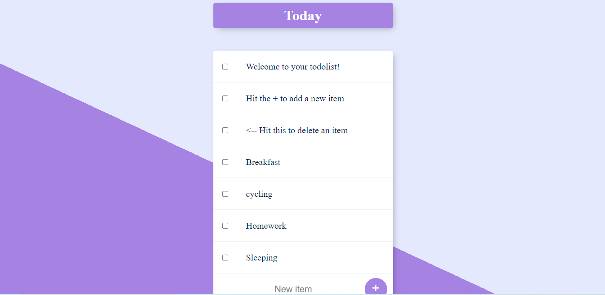

# To-do List App

### The project is based on a to-do list App. The project facilities you to note down all your important work and remove it when it's done.

## Technology used

### Frontend :- HTML, CSS, Javascript

### Backend :- Nodejs, Express(server), MongoDB(Database)


## Installation

Install my-project with npm

```bash
  npm install my-project
  cd my-project
```
    
     
## Run Locally

Clone the project

```bash
  git clone https://link-to-project
```

Go to the project directory

```bash
  cd my-project
```

Install dependencies

```bash
  npm install
```

Start the server

```bash
  npm run start
```

## Optimizations

To start your own to-do list app include "/your_name" at the end of the url and your name will be displayed at the top and you can use it.


## Link

### https://peaceful-fjord-22889.herokuapp.com/


## Screenshots





